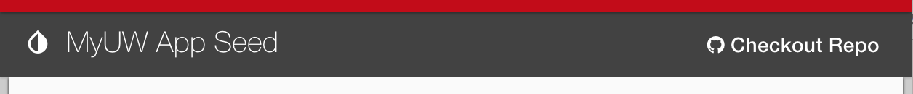

# How to configure in-app options template



This project is preconfigured with an example version of in-app options. Follow these steps to replace it with your own custom app options.

## Part 1: Create an HTML template

In the `webapp/my-app/templates/` directory, create a file called **app-options.html**. Add your own content or use the following example content:

```html
<div layout="row" layout-align="end center">
  <md-menu md-position-mode="target-right bottom">
    <md-button aria-label="Open options menu" class="md-primary" ng-click="$mdOpenMenu($event)">
      <span layout="row" layout-align="center center"><md-icon>settings</md-icon></span>
      <md-tooltip md-direction="bottom" md-delay="500">Settings</md-tooltip>
    </md-button>
    <md-menu-content width="4">
      <md-menu-item>
        <md-button class="md-default" href="#">Give feedback</md-button>
      </md-menu-item>
      <md-menu-item>
        <md-button class="md-default" href="https://github.com/UW-Madison-DoIT/my-app-seed"><span><i class="fa fa-github"></i> Checkout Repo</span></md-button>
      </md-menu-item>
    </md-menu-content>
  </md-menu>
</div>
```

### More info

- The `layout` and `layout-align` attributes are part of the AngularJS Material library. [See more about layout management](https://material.angularjs.org/latest/layout/introduction).
- The elements and CSS classes prefixed with `md-` are also part of the AngularJS Material library. [See the documentation for the `<md-menu>` directive here](https://material.angularjs.org/latest/demo/menu).

## Part 2: Set the path to your template in override.js

Navigate to `webapp/js/override.js` and edit the **optionsTemplateURL**:

```js
'APP_OPTIONS': {
  'optionsTemplateURL': 'my-app/templates/app-options.html',
},
```

Now run the app and you should see your new app options!
